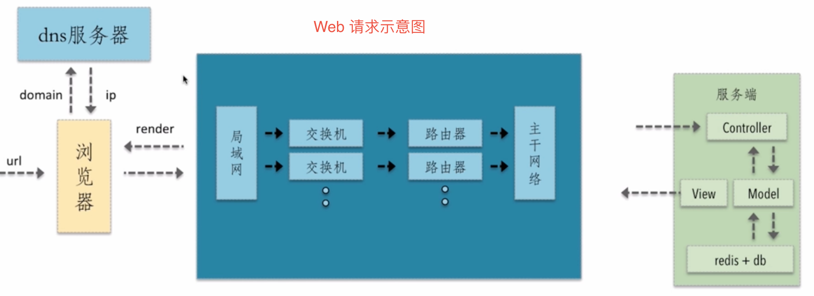
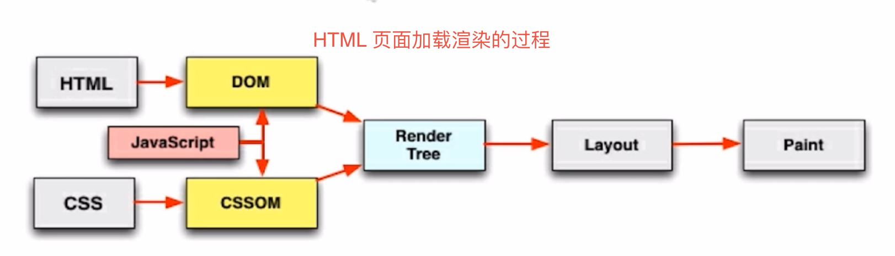
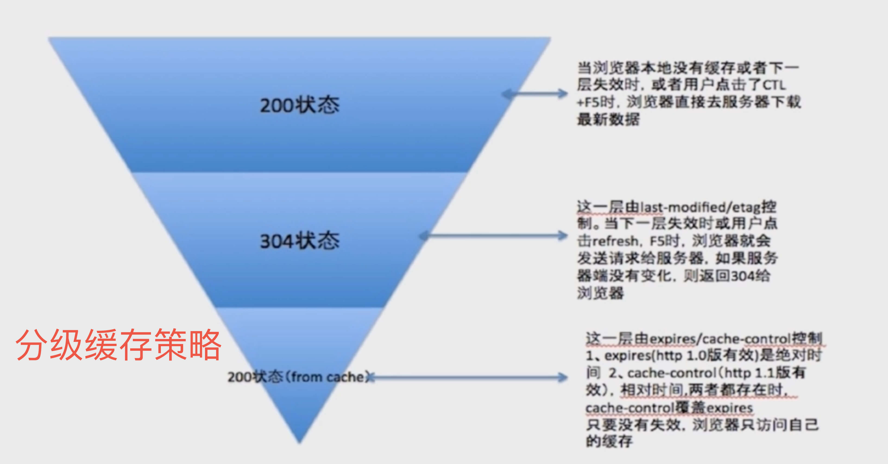

# Web Optimize（Web 优化）

**前端性能优化——原理与实践**

> 前置知识：HTML\CSS\JS\Vue

> 涉及内容：
>
> * 网络层面
> * 构建层面
> * 浏览器渲染层面
> * 服务端层面
> ---
> * 资源的合并与压缩
> * 图片编码原理与类型的选择
> * 浏览器渲染机制
> * 懒加载预加载
> * 浏览器存储
> * 缓存机制
> * PWA
> * Vue-SSR

> 前端性能优化原理：
>
> * 作用及原理
> * 如何与真实场景结合
> * 理论结合实践
> * 量化分析

# 目录（Contents）

* [1. 基础优化](#1-基础优化)
	* [1.1 资源的合并与压缩-HTTP请求的过程及潜在的性能优化](#11-资源的合并与压缩-http请求的过程及潜在的性能优化点)
		* [1.1.1 HTML 压缩](#111-html-压缩)
		* [1.1.2 CSS 压缩](#112-css-压缩)
		* [1.1.3 JS 压缩和混乱](#113-js-压缩和混乱)
		* [1.1.4 文件合并](#114-文件合并)
		* [1.1.5 开启 gzip](#115-开启-gzip)
	* [1.2 图片压缩](#12-图片压缩)
* [2. 进阶优化](#2-进阶优化)
	* [2.1 CSS、JS 的加载与执行](#21-cssjs-的加载与执行)
	* [2.2 懒加载和预加载](#22-懒加载和预加载)
	* [2.3 重绘与回流](#23-重绘与回流)
	* [2.4 浏览器存储](#24-浏览器存储)
		* [2.4.1 Cookies](#241-cookies)
		* [2.4.2 localStorage](#242-localstorage)
		* [2.4.3 sessionStorage](#243-sessionstorage)
		* [2.4.4 IndexedDB](#244-indexeddb)
		* [2.4.5 service worker](#245-service-worker)
	* [2.5 浏览器缓存](#25-浏览器缓存)
		* [2.5.1 HTTP Headers](#251-http-headers)
			* [2.5.1.1 缓存策略控制 - cache-control](#2511-缓存策略控制---cache-control)
			* [2.5.1.2 设置缓存过期时间 - Expires](#2512-设置缓存过期时间---expires)
			* [2.5.1.3 基于客户端和服务端协商的缓存机制 - Last-modified and If-Modified-Since](#2513-基于客户端和服务端协商的缓存机制---last-modified-and-if-modified-since)
			* [2.5.1.4 基于文件 hash 值校验的缓存机制 - Etag and If-None-Match](#2514-基于文件-hash-值校验的缓存机制---etag-and-if-none-match)
		* [2.5.2 多级缓存策略](#252-多级缓存策略)

* [3. 综合服务端的优化](#3-综合服务端的优化)


## 1. 基础优化



HTTP请求的过程及潜在的性能优化点：

* dns：可通过缓存减少 dns 查询时间
* 网络请求：网络请求走最近的网络环境
* 静态资源：缓存相同的静态资源
* HTTP 请求：减少 HTTP 请求大小及请求次数
* 页面渲染：采用服务端渲染

### 1.1 资源的合并与压缩-HTTP请求的过程及潜在的性能优化点

node-minify：[官网](https://node-minify.2clics.net) | [Github](https://github.com/srod/node-minify)

HTTP请求的过程性能优化的原则：

* 减少 HTTP 请求的数量
* 减少请求资源的大小

#### 1.1.1 HTML 压缩

**HTML 代码压缩**：压缩这些在文本文件中有意义，但是在 HTML 中**不显示**的字符，包括**空格**、**制表符**、**换行符**等，还有一些有意义的字符，如 **HTML注视** 也可以被压缩。

HTML 压缩方法：

* 使用在线网站进行压缩（很少使用）
* nodejs 中的 [html-minifier](https://node-minify.2clics.net/compressors/html-minifier.html) 工具
* 后端模板引擎渲染压缩

#### 1.1.2 CSS 压缩

**CSS 压缩**：对无效代码压缩，进行 CSS 语义合并。

CSS 压缩方法：

* 使用在线网站进行压缩（很少使用）
* 对 HTML 中的 CSS 使用 [html-minifier](https://node-minify.2clics.net/compressors/html-minifier.html) 进行压缩
* 使用 [clean-css](https://github.com/jakubpawlowicz/clean-css) 进行压缩

#### 1.1.3 JS 压缩和混乱

**JS 压缩和混乱**：是对 JS 中的无效字符进行删除、删除注视、代码语义的缩减与优化、代码保护。

JS 压缩和混乱方法：

* 使用在线网站进行压缩（很少使用）
* 对 HTML 中的 JS 使用 [html-minifier](https://node-minify.2clics.net/compressors/html-minifier.html) 进行压缩
* 使用 [uglifyjs2](http://lisperator.net/uglifyjs/) 进行压缩

#### 1.1.4 文件合并

不进行文件合并的缺点：

* 文件与文件之间有插入的上行请求，增加了 N-1 个网络延迟
* 受丢包问题影响更严重
* 经过代理服务器时可能会被断开

文件合并的缺点：

* 首屏渲染问题
* 缓存失败问题

文件合并的原则：

* 公共库合并
* 分页面合并
* 根据业务场景进行合并

文件合并的方法：

* 使用在线网站进行压缩（很少使用）
* 构建时进行文件合并

#### 1.1.5 开启 gzip

### 1.2 图片压缩

**图片压缩**：针对真实图片情况，舍弃一些相对无关紧要的色彩信息。

[tinypng - 图片压缩](https://tinypng.com) |
[智图 - 图片格式转换](https://zhitu.isux.us) |
[spritecow - 雪碧图制作](http://www.spritecow.com)

png8/png24/png32 之间的区别：

* png8 - 256色，支持透明
* png24 - 2^24色，不支持透明
* png32 - 2^24色，支持透明

不同格式图片的区别：

* [jpg](https://zh.wikipedia.org/wiki/JPEG) - 有损压缩，压缩率高，不支持透明（不需要透明图片的业务场景）
* [png](https://zh.wikipedia.org/wiki/PNG) - 支持透明，浏览器兼容性好（需要透明图片的业务场景）
* [webp](https://zh.wikipedia.org/wiki/WebP) - 压缩程度好，在 ios webview 有兼容性问题（安卓广泛使用）
* [SVG 矢量图](https://developer.mozilla.org/zh-CN/docs/Web/SVG) - 代码内嵌，相对较小（图片样式简单）
* [gif](https://zh.wikipedia.org/wiki/GIF) - 动图，不可取代（动图）

图片压缩方法：

* [CSS 雪碧图](https://zh.wikipedia.org/wiki/%E7%B2%BE%E7%81%B5%E5%9B%BE)：优点-减少 HTTP 请求数量，缺点-图片较大，页面上有较多的图片信息依赖于一张图的加载。（较少使用）
* Image inline：将图片内容内嵌到 HTML 上，减少 HTTP 强求的数量。如使用矢量图 SVG 进行简单图片的绘制，使用 confont 解决 icon 问题。（一个 [iconfont](https://www.iconfont.cn) 图标网站）

## 2. 进阶优化

### 2.1 CSS、JS 的加载与执行



HTML 渲染过程的特点：

* 顺序执行，并发加载
	* 词法分析 - 对 HTML 文档进行解析，顺序执行
	* 并发加载 - Web 资源并发请求
	* 并发上限 - 对同一域名下的并发请求有数量上的限制
* 阻塞
	* CSS 阻塞
		* CSS head 中阻塞页面的渲染 - CSS 在 head标签 中通过 link 方式引入时需等待 CSS 加载完后页面才会渲染，渲染出的页面带有样式，可避免页面闪动。**推荐使用**
		* CSS 阻塞 JS 的执行 - 在 CSS 加载完成之前，后续 JS 执行会被阻塞
		* CSS 不阻塞外部脚本的加载 - CSS 不会阻塞后续 JS 的加载，但会阻塞其执行
	* JS 阻塞
		* JS script 中阻塞页面渲染 - JS 通过 script标签 引入时需等待 JS 加载完成后页面才会渲染
		* JS 是顺序执行的 - 对多个 JS 脚本的执行是按引入顺序执行的，并且每一个脚本的执行都会阻塞后续脚本的执行（单线程）
		* JS 不阻塞资源加载
* 依赖关系
* 引入方式

### 2.2 懒加载和预加载

[懒加载和预加载 - 掘金](https://juejin.im/post/5b0c3b53f265da09253cbed0) | [懒加载和预加载 - 简书](https://www.jianshu.com/p/4876a4fe7731)

**懒加载**：在所需资源（多为图片）进入可视区域后再请求资源，可减少无效资源的加载，避免并发请求资源过多导致的阻塞问题。适用于图片较多、页面较长的业务场景。

懒加载库：[jquery_lazyload](https://github.com/tuupola/jquery_lazyload)

[Javascript图片预加载详解](http://web.jobbole.com/86785/)

```html
<!-- 前台需要懒加载的图片标签（一定要有 height属性） -->

```

```js
// 可视区域的高度
var viewHeight = document.documentElement.clientHeight;

// 懒加载方法
function lazyLoad() {
    var eles = document.querySelectorAll('img[data-original][lazyload]');
    Array.prototype.forEach.call(eles, function(item, index) {
        var rect;
        if( item.dataset.original === '' )
            return;
        rect = item.getBoundimgClientRect();

        if( rect.bottom >= 0 && rect.top < viewHeight ) {
            !function() {
                var img = new Image();
                mg.src = item.dataset.original;
                img.onload = function() {
                    item.src = img.src;
                }
                item.removeAttribute('data-original');
                item.removeAttribute('lazyload')
            }
        }
    })
}

lazyLoad();// 加载时先调用一次，显示第一屏的图片
document.addElementListener('scroll', lazyload);
```

**预加载**：对图片等静态资源使用之前提前请求，资源使用时可从缓存中加载，提升用户体验。

预加载库：[preloadjs](https://www.createjs.com/preloadjs)

### 2.3 重绘与回流

频繁触发重绘与回流，会导致 UI 频繁渲染，从而导致 JS 变慢，这就是 CSS 性能让 JavaScript 变慢的原因。

**回流**：当 render-tree 中的一部分（或全部）因为元素的规模尺寸、布局、显示隐藏等改变而需要重新构建时称为回流。当页面布局和几何属性发生变化时就需要回流。

**重绘**：当 render-tree 中的元素需要更新属性，而这些属性只是影响元素的外观、风格，而不影响布局时称为重绘。

回流必将引起重绘，重绘不一定会引起回流。

触发页面重布局的属性：

| [盒子模型](https://developer.mozilla.org/zh-CN/docs/Web/CSS/CSS_Box_Model/Introduction_to_the_CSS_box_model)相关属性 | 定位属性及浮动 |  改变节点内部文字结构的属性 |
| :-----------: | :-------------------: | :-------------------: |
| [width](https://developer.mozilla.org/zh-CN/docs/Web/CSS/@media/width) / [height](https://developer.mozilla.org/zh-CN/docs/Web/CSS/height)	| [top](https://developer.mozilla.org/zh-CN/docs/Web/CSS/top) / [bottom](https://developer.mozilla.org/zh-CN/docs/Web/CSS/bottom) / [left](https://developer.mozilla.org/zh-CN/docs/Web/CSS/left) / [right](https://developer.mozilla.org/zh-CN/docs/Web/CSS/right) | [text-align](https://developer.mozilla.org/zh-CN/docs/Web/CSS/text-align)			|
| [padding](https://developer.mozilla.org/zh-CN/docs/Web/CSS/padding) / [margin](https://developer.mozilla.org/zh-CN/docs/Web/CSS/margin) | [position](https://developer.mozilla.org/zh-CN/docs/Web/CSS/position) | [overflow](https://developer.mozilla.org/zh-CN/docs/Web/CSS/overflow) / [overflow-y](https://developer.mozilla.org/zh-CN/docs/Web/CSS/overflow-y) |
| [display](https://developer.mozilla.org/zh-CN/docs/Web/CSS/display) | [float](https://developer.mozilla.org/zh-CN/docs/CSS/float) | [font 相关属性](https://developer.mozilla.org/zh-CN/docs/Web/CSS/CSS_Fonts) |
| [border 相关属性](https://developer.mozilla.org/zh-CN/docs/Web/CSS/border) | [clear](https://developer.mozilla.org/zh-CN/docs/Web/CSS/clear) | [line-height](https://developer.mozilla.org/zh-CN/docs/Web/CSS/line-height) |
| [min-height](https://developer.mozilla.org/zh-CN/docs/Web/CSS/min-height) |						| [vertical-align](https://developer.mozilla.org/zh-CN/docs/Web/CSS/vertical-align) |
| 				| 						| [white-space](https://developer.mozilla.org/zh-CN/docs/Web/CSS/white-space) |

将频繁重绘和回流的 DOM 元素单独作为一个独立图层，那么这个 DOM 元素的重绘和回流的影响只会在这个图层1.

创建图层的条件：

1. 3D 或透视变换（perspective transform）CSS 属性
2. 使用加速视频解码的 `<video>` 节点
3. 拥有 3D（WebGL）上下文或加速的 2D 上下文的 `<canvas>` 节点
4. 混合插件（如 flash）
5. 对自己的 opacity 做 CSS 动画或使用一个动画 webkit 变换的元素
6. 拥有加速 CSS 过滤器的元素
7. 元素有一个包含复合层的后代节点（一个元素拥有一个子元素，该子元素在自己的层里）
8. 元素有一个 z-index 较低且包含一个复合层的兄弟元素

减少重绘与回流的优化点：

1. 用 translate 替代 top
2. 用 opacity 替代 visibility
3. 不要频繁的修改元素的单个样式，使用 className 整体修改
4. 把 DOM 离线后修改（如先把 DOM 隐藏（display=none,一次 Reflow）然后修改，完成后再显示）
5. 不要把 DOM 节点的属性值放在一个循环里当成循环的变量
6. 不要使用 table 布局（一个很小的改动会造成整个 table 的重新布局）
7. 动画实现的速度的选择
8. 对于动画新建图层（添加 [will-change](https://developer.mozilla.org/zh-CN/docs/Web/CSS/will-change)=transform 或 transform=translateZ(0) 属性）
9. 启用 GPU 硬件加速（使用 transform=translateZ(0)和 transform=translate3d(0, 0, 0) 就可以开启 GPU 加速）

### 2.4 浏览器存储

#### 2.4.1 [Cookies](https://developer.mozilla.org/zh-CN/docs/Web/HTTP/Cookies)

cookies 会造成同一域名下 cdn 的流量损耗。解决办法：cdn 的域名与主站域名分开，这样在请求 cdn 静态文件时就不会发送 cookie。

> 有关 Cookies 的更详细的信息可查看我的另外一个库：  https://github.com/ChanMenglin/WebSecurity#3-前端-cookies-安全性
（这个仓库以 Web 安全为主，但较详细的介绍了 Cookies）

[cookie 操作](code/1-cookie/cookie.html)

```JavaScript
// cookie 操作

// 写入 cookie
document.cookie = 'token=token'

// 读取 cookie
document.cookie // token=token
```

#### 2.4.2 [localStorage](https://developer.mozilla.org/zh-CN/docs/Web/API/Storage/localStorage)

* HTML5 中用于浏览器本地缓存方案
* 不会过期
* 大小 5M 左右
* 仅在客户端使用，不和服务器进行通信
* 接口封装较好
* 经典用例：维护用户态（由于 HTTP 请求的无状态）

[localStorage 操作](code/2-localstorage/localStorage.html)

```JavaScript
// localStorage 操作

// 由于兼容性问题，需要在使用 localStorage 前做一个判断
if (window.localStorage) {
    // 写入 localStorage
    localStorage.setItem('userName', 'jack');

    // 读取 localStorage
    localStorage.getItem('userName')
}
```

#### 2.4.3 [sessionStorage](https://developer.mozilla.org/zh-CN/docs/Web/API/Window/sessionStorage)

* HTML5 中用于浏览器本地缓存方案
* 会话级别的浏览器存储（会话结束后会过期）
* 大小 5M 左右
* 仅在客户端使用，不与服务器通信
* 接口封装较好
* 经典用例：维护表单数据

```JavaScript
// sessionStorage 操作

// 由于兼容性问题，需要在使用 sessionStorage 前做一个判断
if (window.sessionStorage) {
    // 写入 sessionStorage
    sessionStorage.serItem('userName': 'jack');

    // 读取 sessionStorage
    sessionStorage.getItem('userName')
}
```

#### 2.4.4 [IndexedDB](https://developer.mozilla.org/zh-CN/docs/Glossary/IndexedDB)

* 一种低级 API，用于客户端存储大量结构化数据
* 使用索引来实现对数据的高性能索引
* 弥补 sessionStorage 对存储更大量结构化数据的存储瓶颈
* 经典用例：为应用创建离线版本

[使用 IndexedDB](https://developer.mozilla.org/zh-CN/docs/Web/API/IndexedDB_API/Using_IndexedDB)

#### 2.4.5 [service worker](https://developer.mozilla.org/zh-CN/docs/Web/API/Service_Worker_API)

* service worker 是一个脚本，浏览器独立于当前网页，后台运行，实现一些不依赖页面或者用户交互的特性
* 使用场景：拦截和处理网络请求，包括以编程方式来管理被缓存的相应、推送消息、后台同步、geofericing（地图围栏定位）
* service worker 只能在 https 协议下使用（localhost 也可以使用）

> chrome 中查看 service worker：
> 1. chrome://serviceworker-internals/
> 2. chrome://version/#inspect/#service-workers

[service worker - 离线应用](code/4-ServiceWorker/ServiceWorker.html) |
[service worker - 消息推送](code/4-ServiceWorker/msgdome.html)

### 2.5 浏览器缓存

#### 2.5.1 [HTTP Headers](https://developer.mozilla.org/zh-CN/docs/Web/HTTP/Headers)

##### 2.5.1.1 缓存策略控制 - [cache-control](https://developer.mozilla.org/zh-CN/docs/Web/HTTP/Headers/Cache-Control)

* private：私有（如浏览器）
* public：公有（如 CDN）
* max-age：指定缓存的最大有效时间（优先级高于 [Expires](#2512-设置缓存过期时间---expires)）
* s-maxage：指定缓存的最大有效时间（只能指定 public 的缓存设备（如 CDM）的缓存有效时间，优先级高于 max-age）
* no-cache：浏览器向服务器发送请求判断浏览器缓存是否过期，并不是没有缓存
* no-store：不使用缓存

##### 2.5.1.2 设置缓存过期时间 - [Expires](https://developer.mozilla.org/zh-CN/docs/Web/HTTP/Headers/Expires)

* 指定资源的到期时间，为服务器端的具体时间点
* 告诉浏览器在过期时间前浏览器可直接从浏览器缓存读取数据，而无需再次请求

##### 2.5.1.3 基于客户端和服务端协商的缓存机制 - [Last-modified](https://developer.mozilla.org/en-US/docs/Web/HTTP/Headers/Last-Modified) and [If-Modified-Since](https://developer.mozilla.org/en-US/docs/Web/HTTP/Headers/If-Modified-Since)

* last-modified - response header（最后修改时间）
* if-modified-since - request header（客户端所掌握的最后修改时间，服务端若放回 `Status Code:304`：表示浏览器缓存未过期，文件为最新版本，`Status Code:200`：表示缓存已过期，文件已被修改，并发送最新版文件及新的最后需改时间到客户端）
* 需要与 [cache-control](#2511-缓存策略控制---cache-control) 共同使用

> last-modified 的问题
> * 部分服务端无法获取精确的修改时间，无法返回 last-modified
> * 文件修改时间改变，但文件内容未改变

##### 2.5.1.4 基于文件 hash 值校验的缓存机制 - [Etag](https://developer.mozilla.org/en-US/docs/Web/HTTP/Headers/ETag) and [If-None-Match](https://developer.mozilla.org/en-US/docs/Web/HTTP/Headers/If-None-Match)

* 文件内容的 hash 值
* etag - response-header（客户端所掌握的文件 hash 值，优先级高于 if-modified-since）
* if-node-match - request-header（客户端所掌握的文件 hash 值，服务端若放回 `Status Code:304`：表示浏览器缓存未过期，文件为最新版本，`Status Code:200`：表示缓存已过期，文件已被修改，并发送最新版文件及新的文件 hash 值到客户端）
* 需要与 [cache-control](#2511-缓存策略控制---cache-control) 共同使用

> 成功避免 last-modified 的问题，并将校验精度提高到毫秒级

#### 2.5.2 多级缓存策略



[多级缓存策略 - 流程图 PDF](code/5-浏览器缓存/static/缓存策略.pdf)



[多级缓存策略 - cache-control生效情况 PDF](code/5-浏览器缓存/static/catch-contorl生效情况.pdf)



## 3. 综合服务端的优化
